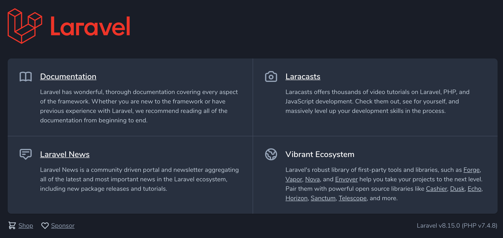

# Team

A web application created to help you manage your team.

Built with:

- PHP 7.4
- MySQL 8
- Laravel 8

## Getting Started

You need to follow some steps in order to run this application in your machine:

1. Install PHP 7.4

2. Install [composer](https://getcomposer.org/) locally

3. Install [Visual Studio Code](https://code.visualstudio.com/) so you can play with the codebase

4. Open the terminal and clone the repository [codehub-learn/lavarel-pfizer](https://github.com/codehub-learn/lavarel-pfizer.git) in a destination of your choice in your machine:

```
$ git clone https://github.com/codehub-learn/lavarel-pfizer.git
```

5. Install the dependencies by using `composer`:

```
$ composer update
```

5. We will use [Homestead](https://laravel.com/docs/8.x/homestead) for development so you need to install first in your machine:

- [Virtualbox](https://www.virtualbox.org/wiki/Downloads)
- [Vagrant](https://www.vagrantup.com/)

6. Then use the `make` command to generate the `Vagrantfile` and `Homestead.yaml` file in your project root. The make command will automatically configure the sites and folders directives in the `Homestead.yaml` file.

```
# Mac / Linux Users
$ php vendor/bin/homestead make

# Windows Users
$ vendor\\bin\\homestead make
```

7. Homestead uses `192.168.10.10` to serve Laravel so instead of calling this IP we can tweak our computer's hosts file under `/etc/hosts` and bind `192.168.10.10` with `homestead.test` by adding a new entry like this:

```
192.168.10.10  homestead.test
```

From now on we will be able to access our application through `homestead.test`

8. Copy `.env.example` to `.env` with:

```
$ cp .env.example .env
```

9. Time to launch Vagrant. Let's run:

```
$ vagrant up
```

When this is done we will be able to open our application in the browser by visiting `homestead.test`



## Useful commands when using Homestead for development

You can check the running VMs with:

```
$ vagrant global-status
```

You can destroy a VM with:

```
$ vagrant destory ID
```

You can reload a VM whenever needed through:

```
$ vagrant reload --provision
```

You can ssh into a VM with:

```
$ vagrant ssh
$ cd code
```

You can run tests by using `phpunit`. First ssh into the VM as shown above and then run:

```
$ phpunit
```

You can install new packages through `composer`. First ssh into the VM as shown above and then run:

```
$ composer require PACKAGE_NAME
```

You can find more details about Vagrant commands in the official [docs](https://www.vagrantup.com/docs/cli).
